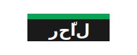

# SOCMINT Visual Identity System - Implementation Guide

This guide provides practical instructions for implementing the SOCMINT visual identity system in both Flutter and web applications. It serves as a quick reference for developers to ensure consistent application of the design system across all platforms.

## Table of Contents

1. [Flutter Implementation](#flutter-implementation)
2. [Web Implementation](#web-implementation)
3. [Logo Usage](#logo-usage)
4. [RTL Support](#rtl-support)
5. [Dark Mode](#dark-mode)

---

## Flutter Implementation

### Setup

1. **Import the design system**:

```dart
import 'package:socmint/design_system/index.dart';
```

2. **Apply the theme in your MaterialApp**:

```dart
MaterialApp(
  theme: SOCMINTTheme.lightTheme(),
  darkTheme: SOCMINTTheme.darkTheme(),
  themeMode: ThemeMode.system, // or ThemeMode.dark for default dark mode
  // ...
)
```

### Using Colors

```dart
// Primary colors
Color primaryColor = SOCMINTColors.rhalGreen;
Color darkColor = SOCMINTColors.rhalDark;

// Accent colors
Color alertColor = SOCMINTColors.uaeRed;
```

### Using Typography

```dart
// Determine text style based on language
final bool isRTL = Directionality.of(context) == TextDirection.rtl;

// Headings
Text(
  'Heading Text',
  style: isRTL ? SOCMINTTextStyles.arabicH1 : SOCMINTTextStyles.englishH1,
)

// Body text
Text(
  'Body text',
  style: isRTL ? SOCMINTTextStyles.arabicBody1 : SOCMINTTextStyles.englishBody1,
)
```

### Using UI Components

```dart
// Primary Button
SOCMINTPrimaryButton(
  text: 'Login',
  onPressed: () => login(),
  icon: Icons.login,
)

// Secondary Button
SOCMINTSecondaryButton(
  text: 'Cancel',
  onPressed: () => cancel(),
)

// Card
SOCMINTCard(
  child: Column(
    children: [
      Text('Card Title', style: SOCMINTTextStyles.englishH4),
      Text('Card content goes here'),
    ],
  ),
)

// Alert
SOCMINTAlert(
  title: 'Warning',
  message: 'This action cannot be undone.',
  type: AlertType.warning,
  onClose: () => dismissAlert(),
)
```

### Using the Logo

```dart
// Standard logo
RHALLogo(
  height: 40,
  isReversed: false, // white on black
)

// Logo with tagline
RHALLogo(
  height: 60,
  showTagline: true,
)

// App icon (square)
RHALAppIcon(
  size: 48,
)
```

---

## Web Implementation

### Setup

1. **Include CSS Variables**:

Add the CSS variables from `socmint_web_tokens.js` to your global CSS file or in the `<head>` of your HTML:

```html
<style>
  :root {
    /* Primary Colors */
    --rhal-green: #00A651;
    --rhal-dark: #1A1A1A;
    
    /* Secondary Colors */
    --white: #FFFFFF;
    --light-gray: #F5F5F5;
    --medium-gray: #CCCCCC;
    --dark-gray: #666666;
    
    /* Accent Colors */
    --uae-red: #EF3340;
    --success: #4CAF50;
    --warning: #FFC107;
    --info: #2196F3;
    
    /* ... other variables ... */
  }
</style>
```

2. **Configure Tailwind** (if using):

```js
// tailwind.config.js
const socmintTokens = require('./socmint_web_tokens.js');

module.exports = {
  theme: socmintTokens.tailwindConfig.theme,
  variants: socmintTokens.tailwindConfig.variants,
  plugins: socmintTokens.tailwindConfig.plugins,
};
```

### Using Colors

```html
<!-- Using CSS variables -->
<div style="color: var(--rhal-green); background-color: var(--rhal-dark);">
  Content
</div>

<!-- Using Tailwind classes -->
<div class="text-rhal-green bg-rhal-dark">
  Content
</div>
```

### Using Typography

```html
<!-- Heading with proper font family -->
<h1 class="font-montserrat text-h1 font-bold leading-tight">
  English Heading
</h1>

<h1 class="font-dubai text-h1 font-bold leading-tight" dir="rtl">
  عنوان عربي
</h1>

<!-- Body text -->
<p class="font-montserrat text-body1 font-regular leading-relaxed">
  English body text
</p>
```

### Using UI Components

```html
<!-- Primary Button -->
<button class="bg-rhal-green text-white font-semibold py-3 px-6 rounded-md hover:bg-opacity-90 transition duration-300">
  Login with UAE PASS
</button>

<!-- Secondary Button -->
<button class="bg-transparent text-rhal-green border border-rhal-green font-semibold py-3 px-6 rounded-md hover:bg-rhal-green hover:bg-opacity-10 transition duration-300">
  Cancel
</button>

<!-- Card -->
<div class="bg-white dark:bg-light-gray rounded-lg shadow-md p-4">
  <h3 class="text-h4 font-semibold">Card Title</h3>
  <p class="text-body1 mt-2">Card content goes here</p>
</div>

<!-- Alert -->
<div class="p-4 rounded-md border bg-warning bg-opacity-10 border-warning text-dark-gray">
  <div class="flex items-start">
    <svg class="w-5 h-5 text-warning mr-3 mt-0.5" fill="none" stroke="currentColor" viewBox="0 0 24 24">
      <path stroke-linecap="round" stroke-linejoin="round" stroke-width="2" d="M12 9v2m0 4h.01m-6.938 4h13.856c1.54 0 2.502-1.667 1.732-3L13.732 4c-.77-1.333-2.694-1.333-3.464 0L3.34 16c-.77 1.333.192 3 1.732 3z" />
    </svg>
    <div>
      <h4 class="font-semibold">Warning</h4>
      <p class="mt-1">This action cannot be undone.</p>
    </div>
  </div>
</div>
```

---

## Logo Usage

### SVG Implementation

Use the provided SVG file (`assets/rhal_logo.svg`) for web applications:

```html

```

Or include the SVG code directly:

```html
<svg width="200" height="80" viewBox="0 0 200 80" xmlns="http://www.w3.org/2000/svg">
  <!-- Green Bar -->
  <rect x="40" y="20" width="120" height="8" fill="#00A651" />
  
  <!-- Background -->
  <rect x="40" y="28" width="120" height="32" fill="#1A1A1A" />
  
  <!-- Arabic Text "رحّال" -->
  <text x="100" y="52" font-family="Dubai, 'Noto Kufi Arabic', sans-serif" font-size="24" font-weight="bold" fill="#FFFFFF" text-anchor="middle" direction="rtl" unicode-bidi="bidi-override">رحّال</text>
</svg>
```

### CSS Implementation

```css
.rhal-logo {
  position: relative;
  font-family: 'Dubai', 'Noto Kufi Arabic', sans-serif;
  font-weight: bold;
  font-size: 32px;
  color: #FFFFFF;
  text-align: center;
  direction: rtl;
  padding-top: 16px;
  width: 120px;
}

.rhal-logo::before {
  content: '';
  position: absolute;
  top: 0;
  left: 0;
  width: 100%;
  height: 8px;
  background-color: #00A651;
}
```

```html
<div class="rhal-logo">رحّال</div>
```

---

## RTL Support

### Flutter

Wrap your app with a `Directionality` widget or use the built-in RTL support in MaterialApp:

```dart
MaterialApp(
  localizationsDelegates: const [
    // ... other delegates
    GlobalMaterialLocalizations.delegate,
    GlobalWidgetsLocalizations.delegate,
    GlobalCupertinoLocalizations.delegate,
  ],
  supportedLocales: const [
    Locale('en'), // English
    Locale('ar'), // Arabic
  ],
  locale: const Locale('ar'), // Force Arabic for testing
  // ...
)
```

### Web

Use the `dir` attribute to set text direction:

```html
<!-- Arabic content -->
<div dir="rtl">
  <p class="font-dubai">محتوى باللغة العربية</p>
</div>

<!-- English content -->
<div dir="ltr">
  <p class="font-montserrat">English content</p>
</div>
```

For full page RTL:

```html
<html dir="rtl" lang="ar">
  <!-- Page content -->
</html>
```

---

## Dark Mode

### Flutter

The design system includes both light and dark themes. To toggle between them:

```dart
// In your state management
ThemeMode _themeMode = ThemeMode.system;

// Toggle theme
void toggleTheme() {
  setState(() {
    _themeMode = _themeMode == ThemeMode.light 
        ? ThemeMode.dark 
        : ThemeMode.light;
  });
}

// In your MaterialApp
MaterialApp(
  theme: SOCMINTTheme.lightTheme(),
  darkTheme: SOCMINTTheme.darkTheme(),
  themeMode: _themeMode,
  // ...
)
```

### Web

For Tailwind, use the dark mode variant:

```html
<div class="bg-white dark:bg-rhal-dark text-rhal-dark dark:text-white">
  This text changes color in dark mode
</div>
```

To toggle dark mode with JavaScript:

```js
// Check for user preference
const prefersDark = window.matchMedia('(prefers-color-scheme: dark)').matches;

// Set initial mode
document.documentElement.classList.toggle('dark', prefersDark);

// Toggle function
function toggleDarkMode() {
  document.documentElement.classList.toggle('dark');
}
```

---

# دليل تنفيذ نظام الهوية البصرية لمنصة SOCMINT

يوفر هذا الدليل تعليمات عملية لتنفيذ نظام الهوية البصرية لمنصة SOCMINT في تطبيقات Flutter وتطبيقات الويب. يعمل كمرجع سريع للمطورين لضمان التطبيق المتسق لنظام التصميم عبر جميع المنصات.

## المحتويات

1. [تنفيذ Flutter](#flutter-implementation)
2. [تنفيذ الويب](#web-implementation)
3. [استخدام الشعار](#logo-usage)
4. [دعم RTL](#rtl-support)
5. [الوضع الداكن](#dark-mode)

---

## تنفيذ Flutter

### الإعداد

1. **استيراد نظام التصميم**:

```dart
import 'package:socmint/design_system/index.dart';
```

2. **تطبيق السمة في MaterialApp الخاص بك**:

```dart
MaterialApp(
  theme: SOCMINTTheme.lightTheme(),
  darkTheme: SOCMINTTheme.darkTheme(),
  themeMode: ThemeMode.system, // أو ThemeMode.dark للوضع الداكن الافتراضي
  // ...
)
```

### استخدام الألوان

```dart
// الألوان الأساسية
Color primaryColor = SOCMINTColors.rhalGreen;
Color darkColor = SOCMINTColors.rhalDark;

// ألوان التأكيد
Color alertColor = SOCMINTColors.uaeRed;
```

### استخدام الطباعة

```dart
// تحديد نمط النص بناءً على اللغة
final bool isRTL = Directionality.of(context) == TextDirection.rtl;

// العناوين
Text(
  'نص العنوان',
  style: isRTL ? SOCMINTTextStyles.arabicH1 : SOCMINTTextStyles.englishH1,
)

// نص الجسم
Text(
  'نص الجسم',
  style: isRTL ? SOCMINTTextStyles.arabicBody1 : SOCMINTTextStyles.englishBody1,
)
```

### استخدام مكونات واجهة المستخدم

```dart
// الزر الأساسي
SOCMINTPrimaryButton(
  text: 'تسجيل الدخول',
  onPressed: () => login(),
  icon: Icons.login,
)

// الزر الثانوي
SOCMINTSecondaryButton(
  text: 'إلغاء',
  onPressed: () => cancel(),
)

// البطاقة
SOCMINTCard(
  child: Column(
    children: [
      Text('عنوان البطاقة', style: SOCMINTTextStyles.arabicH4),
      Text('محتوى البطاقة هنا'),
    ],
  ),
)

// التنبيه
SOCMINTAlert(
  title: 'تحذير',
  message: 'لا يمكن التراجع عن هذا الإجراء.',
  type: AlertType.warning,
  onClose: () => dismissAlert(),
)
```

### استخدام الشعار

```dart
// الشعار القياسي
RHALLogo(
  height: 40,
  isReversed: false, // أبيض على أسود
)

// الشعار مع السطر التوضيحي
RHALLogo(
  height: 60,
  showTagline: true,
)

// أيقونة التطبيق (مربعة)
RHALAppIcon(
  size: 48,
)
```

---

## تنفيذ الويب

### الإعداد

1. **تضمين متغيرات CSS**:

أضف متغيرات CSS من `socmint_web_tokens.js` إلى ملف CSS العالمي الخاص بك أو في `<head>` من HTML الخاص بك:

```html
<style>
  :root {
    /* الألوان الأساسية */
    --rhal-green: #00A651;
    --rhal-dark: #1A1A1A;
    
    /* الألوان الثانوية */
    --white: #FFFFFF;
    --light-gray: #F5F5F5;
    --medium-gray: #CCCCCC;
    --dark-gray: #666666;
    
    /* ألوان التأكيد */
    --uae-red: #EF3340;
    --success: #4CAF50;
    --warning: #FFC107;
    --info: #2196F3;
    
    /* ... متغيرات أخرى ... */
  }
</style>
```

2. **تكوين Tailwind** (إذا كنت تستخدمه):

```js
// tailwind.config.js
const socmintTokens = require('./socmint_web_tokens.js');

module.exports = {
  theme: socmintTokens.tailwindConfig.theme,
  variants: socmintTokens.tailwindConfig.variants,
  plugins: socmintTokens.tailwindConfig.plugins,
};
```

### استخدام الألوان

```html
<!-- استخدام متغيرات CSS -->
<div style="color: var(--rhal-green); background-color: var(--rhal-dark);">
  المحتوى
</div>

<!-- استخدام فئات Tailwind -->
<div class="text-rhal-green bg-rhal-dark">
  المحتوى
</div>
```

### استخدام الطباعة

```html
<!-- العنوان بعائلة الخط المناسبة -->
<h1 class="font-montserrat text-h1 font-bold leading-tight">
  English Heading
</h1>

<h1 class="font-dubai text-h1 font-bold leading-tight" dir="rtl">
  عنوان عربي
</h1>

<!-- نص الجسم -->
<p class="font-montserrat text-body1 font-regular leading-relaxed">
  English body text
</p>
```

### استخدام مكونات واجهة المستخدم

```html
<!-- الزر الأساسي -->
<button class="bg-rhal-green text-white font-semibold py-3 px-6 rounded-md hover:bg-opacity-90 transition duration-300">
  تسجيل الدخول عبر الهوية الرقمية
</button>

<!-- الزر الثانوي -->
<button class="bg-transparent text-rhal-green border border-rhal-green font-semibold py-3 px-6 rounded-md hover:bg-rhal-green hover:bg-opacity-10 transition duration-300">
  إلغاء
</button>

<!-- البطاقة -->
<div class="bg-white dark:bg-light-gray rounded-lg shadow-md p-4">
  <h3 class="text-h4 font-semibold">عنوان البطاقة</h3>
  <p class="text-body1 mt-2">محتوى البطاقة هنا</p>
</div>
```

---

## استخدام الشعار

### تنفيذ SVG

استخدم ملف SVG المقدم (`assets/rhal_logo.svg`) لتطبيقات الويب:

```html

```

أو قم بتضمين كود SVG مباشرة:

```html
<svg width="200" height="80" viewBox="0 0 200 80" xmlns="http://www.w3.org/2000/svg">
  <!-- الشريط الأخضر -->
  <rect x="40" y="20" width="120" height="8" fill="#00A651" />
  
  <!-- الخلفية -->
  <rect x="40" y="28" width="120" height="32" fill="#1A1A1A" />
  
  <!-- النص العربي "رحّال" -->
  <text x="100" y="52" font-family="Dubai, 'Noto Kufi Arabic', sans-serif" font-size="24" font-weight="bold" fill="#FFFFFF" text-anchor="middle" direction="rtl" unicode-bidi="bidi-override">رحّال</text>
</svg>
```

### تنفيذ CSS

```css
.rhal-logo {
  position: relative;
  font-family: 'Dubai', 'Noto Kufi Arabic', sans-serif;
  font-weight: bold;
  font-size: 32px;
  color: #FFFFFF;
  text-align: center;
  direction: rtl;
  padding-top: 16px;
  width: 120px;
}

.rhal-logo::before {
  content: '';
  position: absolute;
  top: 0;
  left: 0;
  width: 100%;
  height: 8px;
  background-color: #00A651;
}
```

```html
<div class="rhal-logo">رحّال</div>
```

---

## دعم RTL

### Flutter

قم بتغليف تطبيقك بـ `Directionality` أو استخدم دعم RTL المدمج في MaterialApp:

```dart
MaterialApp(
  localizationsDelegates: const [
    // ... مندوبون آخرون
    GlobalMaterialLocalizations.delegate,
    GlobalWidgetsLocalizations.delegate,
    GlobalCupertinoLocalizations.delegate,
  ],
  supportedLocales: const [
    Locale('en'), // الإنجليزية
    Locale('ar'), // العربية
  ],
  locale: const Locale('ar'), // فرض العربية للاختبار
  // ...
)
```

### الويب

استخدم السمة `dir` لتعيين اتجاه النص:

```html
<!-- المحتوى العربي -->
<div dir="rtl">
  <p class="font-dubai">محتوى باللغة العربية</p>
</div>

<!-- المحتوى الإنجليزي -->
<div dir="ltr">
  <p class="font-montserrat">English content</p>
</div>
```

للصفحة الكاملة RTL:

```html
<html dir="rtl" lang="ar">
  <!-- محتوى الصفحة -->
</html>
```

---

## الوضع الداكن

### Flutter

يتضمن نظام التصميم كلاً من السمات الفاتحة والداكنة. للتبديل بينهما:

```dart
// في إدارة الحالة الخاصة بك
ThemeMode _themeMode = ThemeMode.system;

// تبديل السمة
void toggleTheme() {
  setState(() {
    _themeMode = _themeMode == ThemeMode.light 
        ? ThemeMode.dark 
        : ThemeMode.light;
  });
}

// في MaterialApp الخاص بك
MaterialApp(
  theme: SOCMINTTheme.lightTheme(),
  darkTheme: SOCMINTTheme.darkTheme(),
  themeMode: _themeMode,
  // ...
)
```

### الويب

بالنسبة لـ Tailwind، استخدم متغير الوضع الداكن:

```html
<div class="bg-white dark:bg-rhal-dark text-rhal-dark dark:text-white">
  يتغير لون هذا النص في الوضع الداكن
</div>
```

لتبديل الوضع الداكن باستخدام JavaScript:

```js
// التحقق من تفضيل المستخدم
const prefersDark = window.matchMedia('(prefers-color-scheme: dark)').matches;

// تعيين الوضع الأولي
document.documentElement.classList.toggle('dark', prefersDark);

// وظيفة التبديل
function toggleDarkMode() {
  document.documentElement.classList.toggle('dark');
}
```